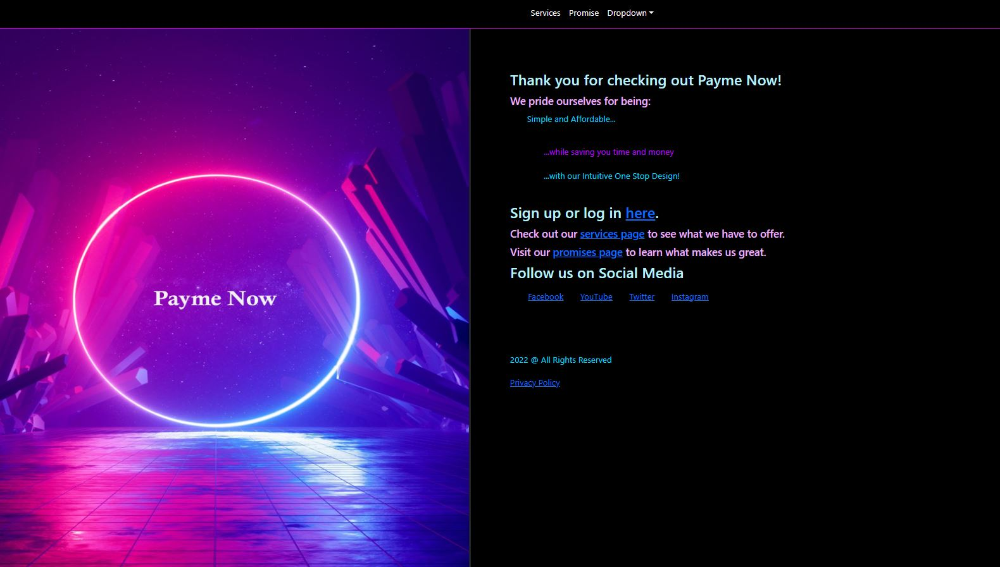
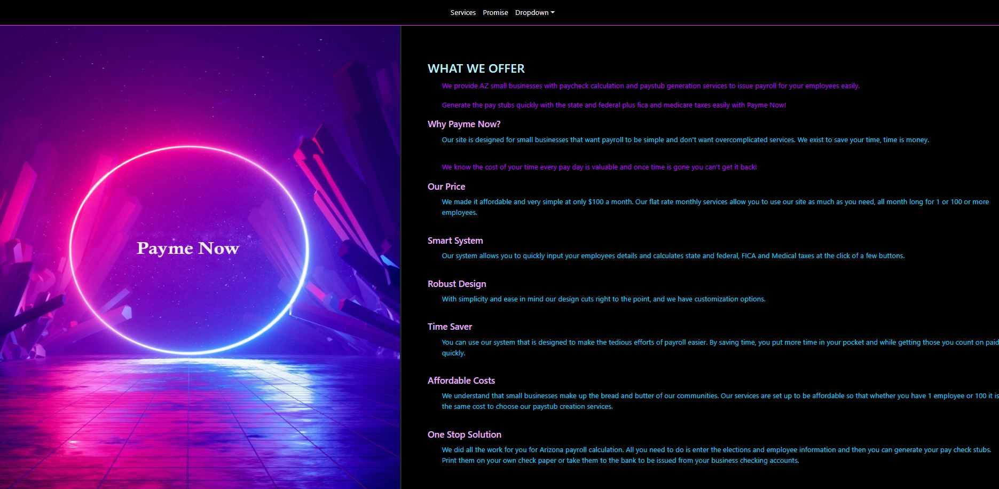
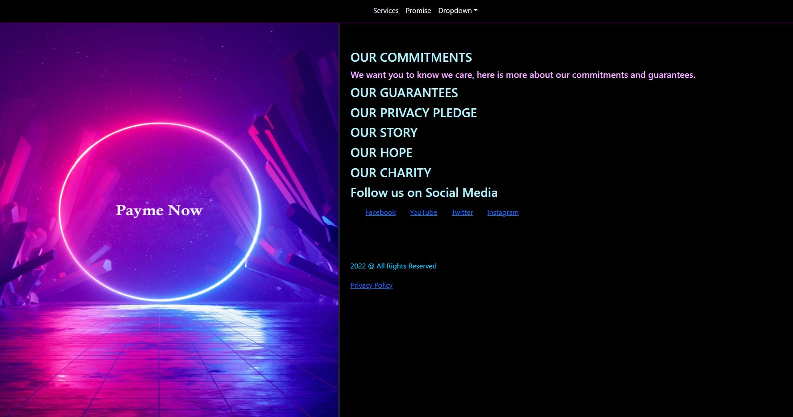
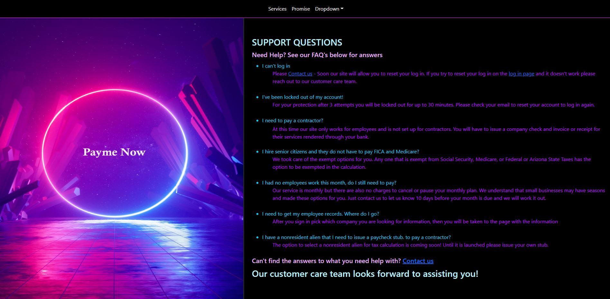
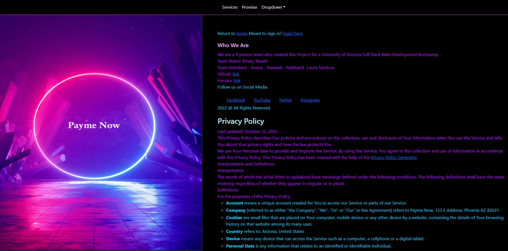

# payme_now

Main Objective: 
Interactive MERN Stack Single-Page Application

Challenge: 
Use React for the front end.
Use GraphQL with a Node.js and Express.js server.
Use MongoDB and the Mongoose ODM for the database.
Use queries and mutations for retrieving, adding, updating, and deleting data.
Be deployed using Heroku (with data).
Have a polished UI.
Be responsive.
Be interactive (i.e., accept and respond to user input).
Include authentication (JWT).
Protect sensitive API key information on the server.
Have a clean repository that meets quality coding standards (file structure, naming conventions, best practices for class and id naming conventions, indentation, high-quality comments, and so on).
Have a high-quality README (with unique name, description, technologies used, screenshot, and link to deployed application).
Can use Bootstrap

Additional Expectations:
    Class presentation
    Add project to past react portfolio assignment

Bonus points for:
    Accepting Payment method.
    Uses a web manifest.
    Uses a service worker for offline functionality.
    Is installable.
    Trying a CSS library other than bootstrap

Presentation link:
    

Website Picture Examples:    
    
    
    
    
    
    
Heroku deploy link: ( coming soon )
    

Git Repository link:
    [Git Repo](https://github.com/SonnyAddison/payme_now)  

Video link of working app deployed: (if applicable)
    

How to deploy a clone of the repo:
    In the terminal of cloned repo you must install the following:
        npm install 
        npm run build
        npm start
    then after the deploy you can view the page on the local host server that is deployed.

References:
    1 - Assignment criteria received in UofA assignments
    2 - Free version of canvas for image content creation
    3 - W3 schools, Slack

MIT License:
    

